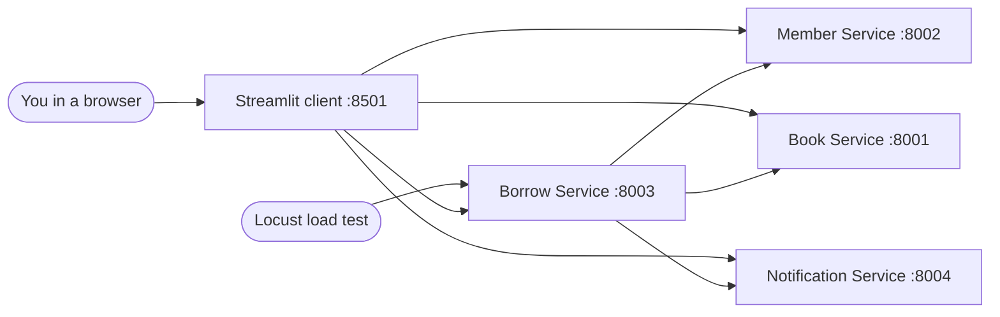

# Implementation Guide — Library Management Microservices

> **How to use this document.** Read it top to bottom once. Every idea is built on the one before it.
> Docker is explained only briefly here, because it has its own document: `dockerexplanation.md`.
> Read that one **second**. If something is unclear, paste the section into another LLM and ask
> it to explain further. The section headings are written to make that easy.

---

## Contents

1. [What this project is, in one paragraph](#1-what-this-project-is-in-one-paragraph)
2. [The background you need first](#2-the-background-you-need-first)
   - 2.1 Client, server and HTTP
   - 2.2 Ports
   - 2.3 What an API is, and what REST means
   - 2.4 JSON
   - 2.5 Status codes
3. [Monolith vs microservices](#3-monolith-vs-microservices)
4. [The technologies used, and why each one](#4-the-technologies-used-and-why-each-one)
   - 4.1 Python
   - 4.2 FastAPI
   - 4.3 Uvicorn
   - 4.4 Pydantic
   - 4.5 SQLite
   - 4.6 httpx
   - 4.7 Streamlit
   - 4.8 Docker and Docker Compose (short version)
   - 4.9 Locust
5. [The application design](#5-the-application-design)
6. [Walking through the code](#6-walking-through-the-code)
   - 6.1 Book Service, line by line
   - 6.2 Member Service and Notification Service
   - 6.3 Borrow Service — the one that talks to the others
   - 6.4 The Streamlit client
7. [The life of one request, step by step](#7-the-life-of-one-request-step-by-step)
8. [How it runs: locally vs in Docker](#8-how-it-runs-locally-vs-in-docker)
9. [Load testing and monitoring](#9-load-testing-and-monitoring)
10. [Understanding the results](#10-understanding-the-results)
11. [Folder structure — what every file does](#11-folder-structure--what-every-file-does)
12. [Demo script for the evaluator](#12-demo-script-for-the-evaluator)
13. [Viva questions with answers](#13-viva-questions-with-answers)
14. [Glossary](#14-glossary)
15. [Complete command sequence for the demonstration](#15-complete-command-sequence-for-the-demonstration)

---

## 1. What this project is, in one paragraph

We built a small **library system** in which you can list books, add members, borrow a book and return it. Instead of writing it as one big program, we split it into **four small programs called microservices**. Each one has a single job and its own small database. They talk to each other over the network by sending HTTP requests. Each service is packaged with **Docker** into a **container**, and all four are started together with **Docker Compose**. A simple web page made with **Streamlit** lets a human use the system. Finally, we used **Locust** to send thousands of requests at the system, at five different load levels, and measured how fast it answered and how much CPU and memory each container used. The lab is mainly about **Docker**: packaging, deploying, connecting and monitoring services. The library logic is deliberately kept simple.

---

## 2. The background you need first

### 2.1 Client, server and HTTP

Almost everything on the web follows one pattern:

- A **server** is a program that runs all the time and **waits** for requests.
- A **client** is a program that **sends a request** to the server and waits for the **response**.

A web browser is a client, and the program behind a website is a server. The language they speak is **HTTP** (HyperText Transfer Protocol). An HTTP request has:

| Part | Example | Meaning |
|:--|:--|:--|
| **Method** | `GET`, `POST`, `PATCH` | What kind of action you want |
| **URL** | `http://127.0.0.1:8001/books/3` | Which machine, which program on it, which resource |
| **Headers** | `Content-Type: application/json` | Extra information about the request |
| **Body** (optional) | `{"title": "Clean Code"}` | Data you are sending |

The server replies with a **status code** (such as `200`) and usually a **body** containing data.

A program can act as a server and a client at the same time. Our **Borrow Service** is a good example. It is a server for whoever calls it, and it is also a client when it calls the Book and Member services.

### 2.2 Ports

One computer can run many server programs. When a request arrives, the computer needs to know which program it is for. That is what a **port** is: a number from 0 to 65535 that identifies one listening program on a machine.

```
http://127.0.0.1:8001/books
       └───┬───┘ └┬─┘└─┬──┘
      which machine │   which resource inside that program
                which program (port)
```

- `127.0.0.1` is a special address that means **this same computer**. It is also called `localhost`.
- In our project each service listens on its own port:

| Program | Port |
|:--|:-:|
| Book Service | 8001 |
| Member Service | 8002 |
| Borrow Service | 8003 |
| Notification Service | 8004 |
| Streamlit web page | 8501 |
| Locust web UI (optional) | 8089 |

Two programs cannot listen on the same port on the same machine. That is why you had to **stop the four local terminals** before starting Docker: the ports were already taken.

### 2.3 What an API is, and what REST means

An **API** (Application Programming Interface) is the list of requests a program accepts and the responses it gives back. It is the program's "menu" for other programs.

**REST** is a common style for designing web APIs. Its main ideas are:

- Everything is a **resource** with a URL: `/books`, `/books/3`, `/members`.
- The **HTTP method** says what to do with it:

| Method | Meaning | Example in our project |
|:--|:--|:--|
| `GET` | Read, without changing anything | `GET /books` → list of books |
| `POST` | Create something new | `POST /books` → add a book |
| `PATCH` | Change part of something | `PATCH /books/3/availability` → mark book 3 borrowed |
| `DELETE` | Remove (not used here) | — |

- Each request carries everything the server needs to answer it. The server does not remember the previous request; this is called being **stateless**. Data that must be remembered goes into the **database**.

Each of these entries is called an **endpoint**, for example `GET /books/{book_id}`.

### 2.4 JSON

Programs need a common format for exchanging data. **JSON** (JavaScript Object Notation) is plain text that looks like this:

```json
{
  "id": 1,
  "title": "Clean Code",
  "author": "Robert C. Martin",
  "available": true
}
```

- `{ }` is an object: a set of key → value pairs.
- `[ ]` is a list.

Almost every language can read and write JSON. In Python, a JSON object becomes a `dict` and a JSON list becomes a `list`. All our services send and receive JSON.

### 2.5 Status codes

Every HTTP response starts with a three-digit number. The ones you will see in this project:

| Code | Meaning | When our services return it |
|:-:|:--|:--|
| **200** OK | It worked | Normal successful `GET`, `PATCH` |
| **201** Created | Something new was created | `POST /books`, `POST /members`, `POST /borrow` |
| **400** Bad Request | The request does not make sense | Borrowing for an inactive member |
| **404** Not Found | That thing does not exist | `GET /books/999` |
| **409** Conflict | It clashes with the current state | Borrowing a book that is already borrowed |
| **422** Unprocessable | The data is in the wrong shape | Sending `"book_id": "abc"` instead of a number (FastAPI does this automatically) |
| **503** Service Unavailable | A service we depend on cannot be reached | Borrow cannot contact Book Service |

**2xx means success, 4xx means the client made a mistake, and 5xx means the server or a dependency failed.**

---

## 3. Monolith vs microservices

### 3.1 The monolith

The traditional way to build an application is **one program** containing everything (books, members, borrowing, notifications), usually with **one shared database**. This is called a **monolith**.

Monoliths are fine for small projects, and they are simpler to build. Their problems appear when the application and the team grow:

- **One bug can bring down everything.** If the notification code crashes the process, nobody can borrow books.
- **You must redeploy everything** to change one small part.
- **You can only scale everything together.** If borrowing is busy but members is not, you still have to run more copies of the whole program.
- **Everyone works in the same codebase,** so teams get in each other's way.
- **The whole program uses one technology stack.**

### 3.2 Microservices

A **microservice architecture** splits the application into **several small, independent programs**. Each one:

1. has **one clear responsibility**, for example "manage books";
2. **owns its own data**, so no other service touches its database directly;
3. exposes a **REST API**, which is the only way other services can interact with it;
4. can be **started, stopped, updated and scaled on its own**.

**Benefits:** isolation of failures, independent deployment, independent scaling, and freedom to use a different technology per service.

**Costs:** services now talk over a **network**, which is slower than a function call and can fail. There are many more moving parts to deploy and monitor. Data is split across databases, which makes consistency harder.

That second list of costs is exactly why **Docker and Docker Compose** matter here. They make it practical to package and run many small services. See `dockerexplanation.md`.

### 3.3 "Database per service"

In our project each service has its **own SQLite file**: `books.db`, `members.db`, `borrows.db` and `notifications.db`.

The Borrow Service needs to know whether a book is available, but it is **not allowed** to open `books.db` directly. It must **ask** the Book Service through its API (`GET /books/3`). This rule keeps services independent. The Book Service could change its database completely, and as long as its API stays the same, nothing else breaks.

---

## 4. The technologies used, and why each one

### 4.1 Python
The programming language for all services, the client, the load test and the graphs. It was chosen because it is simple and has excellent web libraries.

### 4.2 FastAPI
**FastAPI** is a Python **web framework**: a library that makes it easy to write an HTTP server. You write a normal Python function and put a **decorator** above it that says which URL and method it handles:

```python
from fastapi import FastAPI
app = FastAPI()

@app.get("/health")          # "when a GET request arrives at /health, run this function"
def health():
    return {"status": "healthy"}   # FastAPI converts this dict to JSON automatically
```

What FastAPI gives you for free:
- **Routing:** it matches the incoming URL and method to the right function.
- **Parameter parsing:** in `def get_book(book_id: int)`, the `{book_id}` from the URL is converted to an integer automatically. If it can't be converted, the client gets a `422`.
- **JSON conversion:** return a `dict` or `list`, and it becomes a JSON response.
- **Validation** of request bodies using Pydantic models (see 4.4).
- **Automatic documentation:** every FastAPI app has an interactive page at **`/docs`** (Swagger UI) where you can try every endpoint in the browser. This is what you used in Checkpoint 1.

### 4.3 Uvicorn
FastAPI describes **what** to do with each request, but it does not open a port and listen for network traffic itself. That job is done by an **ASGI server**, and **Uvicorn** is the one we use. The command

```bash
uvicorn main:app --host 0.0.0.0 --port 8001
```

means: "load the file `main.py`, find the object called `app` in it, and serve it on port 8001 on all network interfaces."

- `--host 127.0.0.1` would accept connections **only from the same machine**.
- `--host 0.0.0.0` accepts connections arriving on **any network interface**. Inside Docker this is essential, as explained in `dockerexplanation.md`.

**Threads:** our endpoint functions are normal `def` functions, not `async def`. FastAPI runs each of them in a **thread pool**, so several requests can be handled at the same time. You saw this in `docker stats`: the PIDS (processes/threads) column of borrow-service went from 2 to 17 under load.

### 4.4 Pydantic
Pydantic is used by FastAPI to describe the **shape of the data** a request must contain:

```python
class BookIn(BaseModel):
    title: str
    author: str

@app.post("/books")
def add_book(book: BookIn): ...
```

If a client sends `{"title": "X"}` without an author, FastAPI rejects it with `422` before your function even runs. You get input validation without writing any checking code.

### 4.5 SQLite
**SQLite** is a database stored in **a single file**. It needs no separate database server and is built into Python (`import sqlite3`). It was chosen because the lab is about Docker, not databases. A real system would usually use PostgreSQL or MySQL, but the code structure would be the same.

We use plain SQL:

```sql
CREATE TABLE IF NOT EXISTS books (id INTEGER PRIMARY KEY AUTOINCREMENT, title TEXT, author TEXT, available INTEGER);
SELECT * FROM books WHERE id = ?;
UPDATE books SET available = ? WHERE id = ?;
```

The `?` placeholders are filled in safely by `sqlite3`. This prevents **SQL injection** (an attacker sneaking SQL code into a value).

### 4.6 httpx
**httpx** is a Python library for **sending** HTTP requests. FastAPI is for *receiving* requests; httpx is for *making* them. Only the Borrow Service uses it, because it is the only service that calls other services.

### 4.7 Streamlit
**Streamlit** builds simple web pages using only Python, with no HTML or JavaScript. Our page (`frontend/app.py`) shows the dashboard, books, members, borrow/return and notifications. Streamlit is the **client** in our architecture. It has no database and no logic of its own; it only calls the four APIs and displays the results.

### 4.8 Docker and Docker Compose (short version)
- **Docker** packages a program together with everything it needs (Python, libraries, code) into an **image**, and runs it as an isolated **container**.
- **Docker Compose** starts several containers together from one file (`docker-compose.yml`). It puts them on a private network where they can find each other **by name**.

The full explanation is in `dockerexplanation.md`.

### 4.9 Locust
**Locust** is a **load-testing tool** written in Python. You describe what a "user" does (here: call `GET /borrow/check` again and again), and Locust simulates many such users at the same time. It records how many requests were made, how many failed, how long they took, and the requests per second.

---

## 5. The application design

### 5.1 The four services

| Service | Port | Job | Its database | Endpoints |
|:--|:-:|:--|:--|:--|
| **Book Service** | 8001 | Keep the list of books and whether each is available | `books.db` | `GET /health`, `GET /books`, `POST /books`, `GET /books/{id}`, `PATCH /books/{id}/availability` |
| **Member Service** | 8002 | Keep the list of library members | `members.db` | `GET /health`, `GET /members`, `POST /members`, `GET /members/{id}` |
| **Borrow Service** | 8003 | Issue and return books. It **coordinates** the other three | `borrows.db` | `GET /health`, `GET /services/status`, `GET /borrow/check`, `POST /borrow`, `POST /return/{id}`, `GET /borrows` |
| **Notification Service** | 8004 | Store messages for members ("You borrowed …") | `notifications.db` | `GET /health`, `POST /notifications`, `GET /notifications` |

On first start, the Book Service fills its table with **10 books** and the Member Service with **5 members**. This is called **seeding**, and it means there is data to play with immediately.

### 5.2 Architecture



The manual requires the shape **Client → Service 1 → Service 2 / Service 3**. In our project that is **Client → Borrow → Member / Book**.

### 5.3 Why four services when the manual says three?

The manual says *exactly three*. We added the Notification Service as an extension so that one request (`POST /borrow`) touches **all four** services, which demonstrates communication more fully. The required three-service path (Borrow → Member + Book) is still there, and it is the one used in the load test. Be ready to say this in the viva. If the evaluator insists on three, the Notification Service could simply be removed from `docker-compose.yml`, and borrowing would then fail only at the notify step.

### 5.4 The design decision behind `/borrow/check`

We needed one API for load testing. `POST /borrow` was a bad choice: after 10 borrows every book is unavailable, so the remaining requests would fail with `409` and the test would measure errors instead of performance. So we added **`GET /borrow/check`**, which does the same **cross-service lookups** (Borrow → Member and Borrow → Book) but **changes nothing**. Every request during the test sees the same state, so the results are fair across all five load levels.

---

## 6. Walking through the code

### 6.1 Book Service, line by line
File: `services/book_service/main.py`

```python
import os
import sqlite3
from contextlib import asynccontextmanager
from fastapi import FastAPI, HTTPException
from pydantic import BaseModel

DB_PATH = os.getenv("DB_PATH", "data/books.db")
```
`os.getenv("DB_PATH", "data/books.db")` reads an **environment variable** called `DB_PATH`. If it isn't set, it uses `data/books.db`. Environment variables are settings given to a program from outside, without changing its code. When run locally, the database goes to `data/books.db`. In Docker, `docker-compose.yml` sets `DB_PATH=/data/books.db`, which is inside a **volume**, so the data survives when the container is deleted.

```python
def get_db():
    conn = sqlite3.connect(DB_PATH, timeout=10)
    conn.row_factory = sqlite3.Row      # lets us read columns by name: row["title"]
    return conn
```
This opens the database file. `timeout=10` means: if another thread is writing at that moment, wait up to 10 seconds instead of failing straight away.

```python
def init_db():
    os.makedirs(os.path.dirname(DB_PATH) or ".", exist_ok=True)
    with get_db() as conn:
        conn.execute("CREATE TABLE IF NOT EXISTS books (...)")
        if conn.execute("SELECT COUNT(*) FROM books").fetchone()[0] == 0:
            conn.executemany("INSERT INTO books (title, author) VALUES (?, ?)", SEED_BOOKS)
```
This creates the folder and the table if they don't exist, and inserts the 10 seed books only if the table is empty. Using `with get_db() as conn:` means the changes are **committed** (saved) automatically at the end of the block.

```python
@asynccontextmanager
async def lifespan(app: FastAPI):
    init_db()          # runs once when the server starts
    yield              # the server runs here, handling requests
                       # (code after yield would run once at shutdown)

app = FastAPI(title="Book Service", version="1.0", lifespan=lifespan)
```
`lifespan` is FastAPI's way of saying "run this when the server starts". Every service prepares its database here.

```python
class BookIn(BaseModel):          # shape of POST /books body
    title: str
    author: str

class AvailabilityIn(BaseModel):  # shape of PATCH body
    available: bool
```

```python
@app.get("/health")
def health():
    return {"service": "book-service", "status": "healthy"}
```
The **health endpoint**. If it answers at all, the process is alive and handling HTTP. Docker calls it every 5 seconds (the **healthcheck**), and Borrow calls it for `/services/status`. It does **not** check the database; it only proves the server is up.

```python
@app.get("/books/{book_id}")
def get_book(book_id: int):
    with get_db() as conn:
        row = conn.execute("SELECT * FROM books WHERE id = ?", (book_id,)).fetchone()
    if row is None:
        raise HTTPException(status_code=404, detail="Book not found")
    return row_to_book(row)
```
`{book_id}` in the path becomes the function argument. FastAPI converts it to `int`. If no row is found, raising `HTTPException(404)` sends a `404` response with `{"detail": "Book not found"}`.

```python
@app.patch("/books/{book_id}/availability")
def set_availability(book_id: int, body: AvailabilityIn):
    get_book(book_id)  # reuses the function above -> 404 if missing
    with get_db() as conn:
        conn.execute("UPDATE books SET available = ? WHERE id = ?", (int(body.available), book_id))
    return get_book(book_id)
```
The Borrow Service calls this to mark a book borrowed (`false`) or returned (`true`). SQLite has no boolean type, so the value is stored as 0 or 1 and converted back to `true`/`false` in `row_to_book`.

### 6.2 Member Service and Notification Service
They follow **exactly the same pattern** as the Book Service: a database path from an environment variable, `init_db` at start-up, a Pydantic model for `POST`, and simple SQL. The only differences are the table and the endpoints.

- **Member Service** (`members` table): `GET /members`, `GET /members/{id}` (404 if missing), `POST /members`.
- **Notification Service** (`notifications` table with `member_id`, `message`, `created_at`): `POST /notifications` saves a message, and `GET /notifications?member_id=1` lists messages, optionally filtered by member. `?member_id=1` is a **query parameter**. FastAPI takes it from `def list_notifications(member_id: int | None = None)`, where `None` means "not given, return all".

This repetition is deliberate. In microservices, each service is self-contained, so small amounts of duplicated code are normal and accepted.

### 6.3 Borrow Service — the one that talks to the others
File: `services/borrow_service/main.py`

**Where are the other services?**
```python
BOOK_URL   = os.getenv("BOOK_SERVICE_URL",   "http://127.0.0.1:8001")
MEMBER_URL = os.getenv("MEMBER_SERVICE_URL", "http://127.0.0.1:8002")
NOTIFY_URL = os.getenv("NOTIFICATION_SERVICE_URL", "http://127.0.0.1:8004")

client = httpx.Client(timeout=5.0)
```
This is the key design point of the whole project. The Borrow Service does **not hard-code** where the other services live; it reads their addresses from environment variables.
- **Run locally**, the variables are not set, so it uses `127.0.0.1:8001`, which is this computer.
- **Run in Docker**, `docker-compose.yml` sets `BOOK_SERVICE_URL=http://book-service:8001`. Here `book-service` is the **name of the container**, which Docker's internal DNS turns into its IP address.

The **same code** works in both places. One shared `httpx.Client` is reused for all calls. It keeps connections open (**keep-alive**), which is faster than opening a new TCP connection every time. `timeout=5.0` means a call to another service that takes longer than 5 seconds is abandoned.

**Calling another service safely:**
```python
def call(method, url, **kwargs):
    try:
        return client.request(method, url, **kwargs)
    except httpx.RequestError as exc:
        raise HTTPException(status_code=503, detail=f"Cannot reach {url}: {exc.__class__.__name__}")
```
If the other service is down or unreachable, the user gets a clear `503 Service Unavailable` instead of a crash. **Network calls can fail**, and handling that is a basic part of microservice design.

```python
def fetch_book(book_id):
    r = call("GET", f"{BOOK_URL}/books/{book_id}")
    if r.status_code == 404:
        raise HTTPException(status_code=404, detail="Book not found")
    if r.status_code != 200:
        raise HTTPException(status_code=502, detail="Book Service returned an error")
    return r.json()           # the JSON text becomes a Python dict
```
`fetch_member` works the same way for the Member Service. `502 Bad Gateway` means "I am fine, but a service I depend on gave me a bad answer".

**Sending a notification (best effort):**
```python
def notify(member_id, message):
    try:
        r = client.post(f"{NOTIFY_URL}/notifications",
                        json={"member_id": member_id, "message": message})
        r.raise_for_status()
        return r.json()["message"]
    except httpx.HTTPError:
        return "Not sent (Notification Service unavailable)"
```
A notification is useful but not essential. If the Notification Service is down, the borrow should **still succeed**, and only the message is skipped. This is called **graceful degradation**: one failing service does not break the whole application. (Tested: with the `notification-service` container stopped, `POST /borrow` still returns 201 and the response says "Not sent".) In contrast, the Book Service **is** essential, so if it is down the borrow fails with 503 and nothing is saved.

**The load-test endpoint (3 services):**
```python
@app.get("/borrow/check")
def check_borrow(member_id: int, book_id: int):
    member = fetch_member(member_id)     # HTTP call -> Member Service
    book = fetch_book(book_id)           # HTTP call -> Book Service
    can_borrow = member["active"] and book["available"]
    return {"member": member["name"], "book": book["title"],
            "member_active": member["active"], "book_available": book["available"],
            "can_borrow": can_borrow}
```

**The full borrow (all 4 services):**
```python
@app.post("/borrow", status_code=201)
def borrow_book(req: BorrowIn):
    member = fetch_member(req.member_id)                       # 1. Member Service: does the member exist?
    if not member["active"]:
        raise HTTPException(status_code=400, detail="Member is not active")
    book = fetch_book(req.book_id)                             # 2. Book Service: does the book exist?
    if not book["available"]:
        raise HTTPException(status_code=409, detail="Book is already borrowed")

    set_book_available(req.book_id, False)                     # 3. Book Service: PATCH, mark borrowed
    ... INSERT INTO borrows ...                                # 4. own database: record the loan
    note = notify(req.member_id, f"You borrowed '{book['title']}' ...")   # 5. Notification Service (best effort)
    return {"borrow_id": ..., "member": ..., "book": ..., "notification": note}
```
`set_book_available` sends the `PATCH` to the Book Service and returns a 502 error if the Book Service does not confirm the change. `POST /return/{borrow_id}` is the mirror image: check the record exists and is not already returned (else 404 / 409), mark the book available, save `returned_at`, notify.

**Status of everything:**
```python
@app.get("/services/status")
def services_status():
    # calls /health on book, member and notification and reports each one
```
The Streamlit dashboard uses this to show the four green "healthy" indicators. That proves the Borrow container can reach the other three over the Docker network.

> **A limitation worth knowing (good viva point).** `POST /borrow` updates two databases in two different services: Book (availability) and Borrow (the loan record). If the program crashed between step 3 and step 4, the book would be marked unavailable with no loan record. A monolith with one database would wrap both in a single **transaction**. In microservices this is a known hard problem, called **distributed transactions** or **data consistency**. Real systems solve it with patterns such as the *Saga pattern*. For a lab project, it is enough to know that the problem exists.

### 6.4 The Streamlit client
File: `frontend/app.py`

```python
BORROW_URL = os.getenv("BORROW_SERVICE_URL", "http://127.0.0.1:8003")   # same env-var trick

def api(method, url, **kwargs):
    r = requests.request(method, url, timeout=5, **kwargs)
    ...returns (data, None) on success, or (None, error message)
```

A sidebar lets the user pick one of five pages. Each page calls the right API and shows the result in a table or form:
- **Dashboard:** `GET /services/status` plus counts of books, members and active borrows.
- **Books / Members:** list (`GET`) and add (`POST`).
- **Borrow / Return:** borrow (`POST /borrow`), return (`POST /return/{id}`) and the history.
- **Notifications:** `GET /notifications`.

**How Streamlit runs:** every time you click something, Streamlit **re-runs the whole script from the top** and redraws the page. That is why the code reads like a simple top-to-bottom script.

**The bug we fixed:** Streamlit has a "magic" feature that displays any **bare expression** on a line by itself. A one-line `st.error(err) if err else st.dataframe(df)` counts as an expression, so Streamlit also printed the expression's result as text on the page. This is the stray text in screenshot 32. We rewrote those lines as normal `if:/else:` blocks. After `docker compose up -d --build frontend` the text is gone.

**Inside Docker,** the browser runs on your laptop, but the Streamlit **Python code runs inside its container**. So the API calls come from inside the Docker network, which is why the frontend uses service names (`http://borrow-service:8003`) too.

---

## 7. The life of one request, step by step

This is what happens when Locust (or you) calls `GET http://127.0.0.1:8003/borrow/check?member_id=2&book_id=5` with everything running in Docker:

1. **Locust** on your Windows laptop opens a TCP connection to `127.0.0.1:8003` and sends the HTTP request.
2. **Docker's port mapping** (`"8003:8003"` in Compose) forwards traffic from port 8003 on your laptop to port 8003 **inside the borrow-service container**.
3. **Uvicorn** inside that container receives the bytes, understands the HTTP request, and hands it to **FastAPI**.
4. **FastAPI** matches `GET /borrow/check` to `check_borrow`, converts `member_id="2"` and `book_id="5"` to integers, and runs the function in a worker thread.
5. `fetch_member(2)` makes **httpx** send `GET http://member-service:8002/members/2`.
   - **Docker's internal DNS** turns `member-service` into that container's IP (e.g. `172.18.0.3`).
   - The request travels over the **`library-net` virtual network** to the member container.
   - The Member Service's Uvicorn and FastAPI run `get_member(2)`, which runs `SELECT … WHERE id = 2` on `/data/members.db`, and returns JSON `{"id":2,"name":"Diya Patel",...,"active":true}`.
6. `fetch_book(5)` does the same against `book-service:8001`.
7. `check_borrow` combines the two answers and returns a dict. FastAPI turns it into JSON with status `200`.
8. The response travels back through Uvicorn and the port mapping to Locust. Locust records the **response time**, which covers all of steps 1–8, about 11 ms when the system is quiet.

**One external request therefore causes two internal requests.** This multiplication is why the Borrow Service does the most work and became the bottleneck.

---

## 8. How it runs: locally vs in Docker

| | **Checkpoint 1: local** | **Checkpoint 2+: Docker** |
|:--|:--|:--|
| How started | 4 terminals, `python -m uvicorn main:app --port 800X` | `docker compose up -d` |
| Python used | The Python installed on your laptop | Python 3.12 inside each container (from the `python:3.12-slim` image) |
| Libraries | Installed on your laptop with pip | Installed inside each image during `docker build` |
| Database location | `services/<name>/data/*.db` on your disk | `/data/*.db` inside a **Docker volume** |
| How Borrow finds Book | `http://127.0.0.1:8001` (default in code) | `http://book-service:8001` (env var from Compose) |
| Isolation | All four share your laptop's environment | Each has its own filesystem, process space and network address |
| Stop | Ctrl+C in each terminal | `docker compose down` |

The **code is identical** in both cases; only the environment variables differ. This is a basic principle of cloud applications, often called *configuration through the environment* (one of the "Twelve-Factor App" rules).

The local and Docker databases are **different files**. That is why the Streamlit screenshots (Docker) show a different borrow history from the Swagger screenshots (local).

---

## 9. Load testing and monitoring

### 9.1 What we wanted to learn
The manual asks how the application behaves as **workload increases**. "Workload" here means **concurrency**: how many requests are in progress at the same moment. We tested 1, 2, 4, 8 and 16 concurrent users (W1–W5), each for 60 seconds.

### 9.2 The Locust file (`loadtest/locustfile.py`)
```python
class LibraryUser(HttpUser):
    wait_time = constant(0)           # no pause between requests

    @task
    def check_borrow(self):
        member_id = random.randint(1, 5)
        book_id = random.randint(1, 10)
        self.client.get(f"/borrow/check?member_id={member_id}&book_id={book_id}", name="/borrow/check")
```
- Each simulated user runs `check_borrow` in a loop: send a request, **wait for the reply**, send the next one.
- With `wait_time = constant(0)` there is no pause, so **each user always has exactly one request in progress**. 16 users therefore means exactly 16 concurrent requests.
- Random IDs mean different members and books are looked up.
- `name="/borrow/check"` groups all the URLs under one row in the statistics.

### 9.3 The automation script (`loadtest/run_workloads.py`)
For each level W1 … W5 it:
1. runs `locust --headless -u <users> -r <users> -t 60s --csv results/raw/W<n>_<users>u`. Headless means without the web UI; `-u` is the number of users; `-r` is how many users to start per second.
2. at the same time, in a **background thread**, runs `docker stats --no-stream` in a loop (about every 2 s). It records each container's CPU % and memory, tagged with the current workload.
3. reads Locust's CSV and keeps the "Aggregated" row: request count, failures, average, median and 95th percentile response time, and requests per second.
4. waits 10 s, then moves to the next level.

At the end it writes:
- `results/observation_table.csv`: one row per workload (the table the manual asks for);
- `results/container_usage.csv`: average and maximum CPU and average memory per container per workload;
- `results/raw/`: everything raw.

Then `scripts/generate_graphs.py` draws the 9 figures in `graphs/`.

### 9.4 What `docker stats` measures
- **CPU %**: the share of CPU time the container used. **100 % = one full CPU core.** A container can show more than 100 % if it uses more than one core (e.g. 127 % ≈ 1.27 cores).
- **MEM USAGE**: RAM used by the container's processes.
- **NET I/O**: bytes sent and received.
- **PIDS**: number of processes and threads in the container.

---

## 10. Understanding the results

### 10.1 The numbers

| Workload | Users | Avg response | Throughput | Failed | Borrow CPU | Book CPU | Member CPU |
|:-:|:-:|--:|--:|:-:|--:|--:|--:|
| W1 | 1 | 11.0 ms | 89.5 req/s | 0 | 51 % | 32 % | 32 % |
| W2 | 2 | 12.3 ms | 160.6 req/s | 0 | 84 % | 47 % | 47 % |
| W3 | 4 | 24.7 ms | 160.8 req/s | 0 | 120 % | 50 % | 51 % |
| W4 | 8 | 53.2 ms | 149.9 req/s | 0 | 127 % | 45 % | 46 % |
| W5 | 16 | 108.2 ms | 147.5 req/s | 0 | 127 % | 44 % | 44 % |

### 10.2 What it means, in order

**1. With 1 user, the system is under-used.** Each request takes about 11 ms, so one user can make at most about 1000 / 11 ≈ 90 requests per second, which is exactly what we measured. The system can do more, but one user can't keep it busy.

**2. With 2 users, throughput almost doubles** (90 → 161 req/s) and response time barely changes. The second user's requests mostly run **in parallel** with the first user's.

**3. From about 2–4 users, the system is saturated.** Throughput stops growing at about **160 req/s**. That is the **maximum capacity** of this setup for this request.

**4. After saturation, extra users only add waiting time.** Response time doubles each time the number of users doubles (24.7 → 53.2 → 108.2 ms). The requests are **queuing**: the server can only finish about 160 per second, so with 16 users in the system, each request waits behind the others.

**5. Little's Law confirms this.** For a closed system:

$$
\text{users} = \text{throughput} \times \text{response time}
$$

Check W5: 147.48 req/s × 0.108 s = 15.96 ≈ 16 users ✔. It holds at every level to within 1 %. Rearranged, **response time = users ÷ throughput**: if throughput is stuck at about 150, then doubling the users must double the response time. This is a law of queues, not a property of our code.

**6. The Borrow Service is the bottleneck.** Its CPU rose until about 1.2–1.3 cores and stayed there, while Book and Member levelled off at about 0.5 core because they were **waiting** for Borrow to send them work. Why Borrow?
- **It does the most work per request:** it receives one request, **sends two** requests, waits for and parses two JSON replies, and builds its own reply. Book and Member just do one database lookup each.
- **It is a single Python process.** Python has a **GIL (Global Interpreter Lock)**: inside one process, only one thread can run Python code at any instant. Threads still help while waiting for the network, but the CPU-heavy part, running Python code, is limited to about **one core per process**. The extra ~25 % above 100 % is work done outside the GIL (network and system calls). The laptop had 16 logical CPUs, but one Python process cannot use them all.

**7. Throughput drops slightly at 8–16 users** (161 → 147 req/s, −8 %). With more concurrent requests, the Borrow Service runs more threads (PIDS went to 17). They compete for the GIL, and the switching between them wastes some CPU.

**8. Memory stays flat** (about 260–270 MiB in total). Each request is small and finishes quickly, so nothing builds up. The differences between containers existed before the test even started.

**9. No failures.** The system got **slower** but never returned errors. The slowest single request (277 ms) was far below the 5 s timeout.

**10. A hidden cost: healthchecks.** Docker runs `python -c "…urlopen('/health')"` in **every** container every 5 seconds. Starting a Python interpreter costs a burst of CPU. That is why the Notification Service, which received **no** load-test traffic, still averaged about 12 % CPU with spikes near 70 %.

### 10.3 How to fix the bottleneck (if asked)
- **Run more copies of the Borrow Service.** Use `uvicorn --workers 4` (four processes, each with its own GIL), or `docker compose up --scale borrow-service=3` behind a load balancer. With our current file you would first have to remove `container_name` and the published port for borrow-service, as explained in `dockerexplanation.md` Section 16. This is **horizontal scaling**, one of the main reasons to use microservices: you scale only the busy service.
- **Make the outgoing calls asynchronous and in parallel** (`async def` with `httpx.AsyncClient` and `asyncio.gather`), so Member and Book are asked at the same time instead of one after the other.
- **Use lighter healthchecks** (for example a 30 s interval).

---

## 11. Folder structure — what every file does

```text
CC_lab_evaluation/
├── README.md                ← the formal lab report (results, graphs, screenshots)
├── implementation.md        ← this file
├── dockerexplanation.md     ← Docker concepts, from zero
├── docker-compose.yml       ← defines and connects all 5 containers
├── .gitignore               ← files Git should ignore (local databases, __pycache__)
├── services/
│   ├── book_service/
│   │   ├── main.py          ← the FastAPI application
│   │   ├── requirements.txt ← Python libraries it needs (fastapi, uvicorn)
│   │   ├── Dockerfile       ← recipe to build its image
│   │   └── .dockerignore    ← files NOT to copy into the image
│   ├── member_service/      ← same four files
│   ├── borrow_service/      ← same four files (+ httpx in requirements.txt)
│   └── notification_service/← same four files
├── frontend/
│   ├── app.py               ← Streamlit client
│   ├── requirements.txt     ← streamlit, requests, pandas
│   └── Dockerfile
├── loadtest/
│   ├── locustfile.py        ← what one simulated user does
│   └── run_workloads.py     ← runs W1–W5 and records docker stats
├── scripts/
│   ├── test_services.py     ← calls every endpoint and prints PASS/FAIL
│   └── generate_graphs.py   ← draws graphs/ from results/
├── results/                 ← measured data (CSV)
├── graphs/                  ← 9 figures
└── screenshots/             ← CP1_… to CP4_… evidence, numbered 01–45
```

---

## 12. Demo script for the evaluator

Follow this order. It walks through the five checkpoints exactly.

```powershell
cd C:\Users\Asus\Desktop\Cloud_computing\PGC\PGC_lab\CC_github\CC_lab_evaluation
```

(Section 15 has every command for this demo in full, with the folder to `cd` into and what you should see.)

**CP1 — show the services (code + APIs).**
1. Open `services/book_service/main.py` and explain: FastAPI app, own database, endpoints.
2. Open `services/borrow_service/main.py` and point at `BOOK_SERVICE_URL` and `fetch_book`. Explain "it calls other services".
3. (If asked to run without Docker, use 4 terminals: `cd services\book_service` then `python -m uvicorn main:app --port 8001`, and likewise for the others. Then run `python scripts\test_services.py`. Stop them with Ctrl+C before step 4.)

**CP2 — containerize and deploy.**
4. Open `services/book_service/Dockerfile` and explain it line by line (see `dockerexplanation.md`).
5. Run `docker compose build`, then `docker images library-app/*`.
6. Run `docker compose up -d`, then `docker ps`. Point out that 4 services show **(healthy)**.

**CP3 — communication.**
7. Run `docker network inspect library-net`. All 5 containers appear on one network.
8. Run `docker exec borrow-service python -c "import urllib.request;print(urllib.request.urlopen('http://book-service:8001/health').read())"`. This is a call **by service name** from inside a container.
9. Open `http://localhost:8501`: Dashboard (all healthy) → Borrow a book → Notifications page shows the new message.

**CP4 — workload.**
10. In terminal 2, run `docker stats book-service member-service borrow-service notification-service`.
11. In terminal 1, show the Locust UI: `python -m locust -f loadtest\locustfile.py --host http://127.0.0.1:8003`. Open `http://localhost:8089`, set 8 users, Start. Show live charts and the `docker stats` changes.
    (The full scripted run, `python loadtest\run_workloads.py`, takes about 6 minutes. Show the saved results instead if time is short.)

**CP5 — results.**
12. Open `README.md` Section 11: the observation table and the graphs. Explain saturation at about 160 req/s, response time doubling, Borrow as the bottleneck, flat memory and 0 failures.

**Clean up:** `docker compose down`.

---

## 13. Viva questions with answers

**Q1. What is a microservice?**
A small, independent program with one responsibility and its own data, which other programs can use only through its API (here REST over HTTP). Our app has four: Book, Member, Borrow and Notification.

**Q2. Why microservices instead of one program?**
Each part can be developed, deployed, scaled and fixed separately, and a failure in one does not have to bring down the others. The price is more network calls and more parts to manage, which Docker Compose helps with.

**Q3. What is FastAPI? What is Uvicorn?**
FastAPI is a Python framework for writing HTTP APIs: you map URLs and methods to Python functions, and it handles validation, JSON and `/docs`. Uvicorn is the server program that listens on a port and passes requests to the FastAPI app.

**Q4. What is REST?**
A style of API in which resources have URLs (`/books/3`) and HTTP methods express the action (GET read, POST create, PATCH update). Each request is self-contained (stateless), and data is exchanged as JSON.

**Q5. How does the Borrow Service talk to the Book Service?**
It sends an HTTP request with httpx to `http://book-service:8001/books/{id}`. `book-service` is the Compose service name, which Docker's internal DNS resolves to the Book container's IP on the `library-net` network.

**Q6. Why does each service have its own database?**
So that services stay independent. No service can break another by changing a shared table; they interact only through APIs. This is the "database per service" pattern.

**Q7. Why did you load-test `/borrow/check` and not `/borrow`?**
`/borrow/check` crosses three services but does not change data, so all load levels see identical conditions. `/borrow` would run out of available books after 10 requests, and the test would measure errors instead of performance.

**Q8. What happened as load increased?**
Throughput rose from 89 to about 160 req/s by 2–4 users and then stayed flat, dropping slightly to 147. Response time stayed at about 11–12 ms up to 2 users, then doubled with every doubling of users, up to 108 ms. There were no failures. This is the standard saturation behaviour, and it matches Little's Law.

**Q9. Which service used the most resources, and why?**
Borrow, at about 1.2–1.3 CPU cores. It makes two outgoing calls per request, and as a single Python process the GIL limits it to roughly one core of Python work.

**Q10. How would you handle more load?**
Scale only the Borrow Service horizontally: more Uvicorn workers or more container replicas behind a load balancer. Also make its outgoing calls asynchronous and parallel.

**Q11. What does "healthy" in `docker ps` mean?**
Docker ran the healthcheck command (a request to `/health`) inside the container and it succeeded. It shows the server process is up and answering HTTP.

**Q12. What is a weakness of your design?**
`POST /borrow` updates data in two services (Book and Borrow) without a shared transaction, so a crash in between could leave them inconsistent. Real systems handle this with patterns such as Sagas. Also, SQLite and a single Uvicorn worker limit scalability.

---

## 14. Glossary

| Term | Meaning |
|:--|:--|
| **API** | The set of requests a program accepts and the responses it returns |
| **Endpoint** | One method + URL combination, e.g. `GET /books/{id}` |
| **REST** | API style based on resource URLs and HTTP methods |
| **HTTP** | The request/response protocol of the web |
| **JSON** | Text format for structured data (`{"key": "value"}`) |
| **Status code** | Three-digit result of an HTTP request (200, 201, 404, 503 …) |
| **Port** | Number identifying a listening program on a machine |
| **localhost / 127.0.0.1** | "This same machine" |
| **Microservice** | Small independent service with one job and its own data |
| **Monolith** | Whole application as one program, usually with one database |
| **FastAPI** | Python framework for building HTTP APIs |
| **Uvicorn** | Server that runs FastAPI apps on a port |
| **Pydantic** | Library that defines and validates data shapes |
| **Swagger UI (`/docs`)** | Auto-generated page to try every API endpoint |
| **SQLite** | File-based SQL database built into Python |
| **httpx / requests** | Python libraries for sending HTTP requests |
| **Streamlit** | Python library for building simple web pages |
| **Environment variable** | A setting passed to a program from outside its code |
| **Healthcheck** | Regular automatic check that a service responds |
| **Seeding** | Filling a new database with starting data |
| **Locust** | Load-testing tool that simulates many users |
| **Concurrency** | Number of requests in progress at the same time |
| **Throughput** | Requests completed per second |
| **Response time / latency** | Time to answer one request |
| **Median / 95th percentile** | Half of requests were faster than the median; 95 % were faster than the 95th percentile |
| **Saturation** | The point where more load no longer increases throughput |
| **Bottleneck** | The component that limits the capacity of the whole system |
| **GIL** | Python lock: one Python process runs Python code on about one core at a time |
| **Little's Law** | Users = throughput × response time |
| **Horizontal scaling** | Running more copies of a service to handle more load |
| **Distributed transaction** | Keeping data consistent across several services' databases (hard problem) |

---

## 15. Complete command sequence for the demonstration

This section lists **every command of the demo, in order**, from Swagger to Streamlit to Locust to Docker and the final results. For each step it says which terminal to use, which folder to `cd` into, the exact command, and what you should see.

The order follows the five checkpoints:

| Part | What you show | Checkpoint |
|:--|:--|:--|
| A | Preparation (terminals, tools) | — |
| B | Services running locally: Swagger, test script, Streamlit, quick Locust | CP1 |
| C | Building images and deploying with Docker Compose | CP2 |
| D | Communication between containers | CP3 |
| E | Load testing with Locust while monitoring with `docker stats` | CP4 |
| F | Results, graphs and report | CP5 |
| G | Clean up | — |

### 15.1 How to execute these commands

- **Where to type them.** Use the terminal inside VS Code. Open one with the menu **Terminal → New Terminal**, or press **Ctrl + Shift + `** (the key above Tab). The terminal is **PowerShell**, and every command below is written for PowerShell.
- **Several terminals.** Some programs keep running and keep the terminal busy (the services, Streamlit, Locust, `docker stats`). Each of these needs **its own terminal**. Click the **+** icon in the terminal panel to open another one. The drop-down or the list on the right of the terminal panel lets you switch between them. You can right-click a terminal to rename it (for example "book", "member").
- **Running a command.** Copy the whole code block, paste it into the terminal (right-click or Ctrl + V), and press **Enter**. Each block starts with a `cd` line, so it works no matter which folder the terminal was in before.
- **`cd`** means "change directory". It moves the terminal into the folder where the files are. If the path is wrong, the command after it will fail with "file not found".
- **Stopping a running program.** Click inside its terminal and press **Ctrl + C**. Wait until the normal prompt (`PS C:\...>`) comes back.
- **Copying from the browser.** URLs such as `http://127.0.0.1:8001/docs` go in the browser's address bar, not the terminal.

The project folder used everywhere below is:

```text
C:\Users\Asus\Desktop\Cloud_computing\PGC\PGC_lab\CC_github\CC_lab_evaluation
```

### 15.2 Part A — Preparation

**Step A1. Check the tools are installed.** Any terminal.

```powershell
cd C:\Users\Asus\Desktop\Cloud_computing\PGC\PGC_lab\CC_github\CC_lab_evaluation
python --version
docker --version
docker compose version
python -m locust --version
```

You should see Python 3.13.x, Docker 29.x, Compose v5.x and Locust 2.x. Version numbers may differ slightly; what matters is that none of them says "not recognized".

**Step A2. Make sure nothing old is running.** If Docker containers of this project are running from an earlier session, they hold ports 8001–8004 and 8501, and the local services in Part B will fail with "address already in use". Start Docker Desktop first only if you want to check this; otherwise skip to Part B.

```powershell
cd C:\Users\Asus\Desktop\Cloud_computing\PGC\PGC_lab\CC_github\CC_lab_evaluation
docker compose down
```

If Docker Desktop is not running you will get an error mentioning `dockerDesktopLinuxEngine`. That is fine here: it means no containers are running, so the ports are free.

### 15.3 Part B — Checkpoint 1: the four services running locally (no Docker)

Here each service is an ordinary Python program on your laptop. You need **4 terminals** for the 4 services, plus a 5th for testing.

**Step B1. Terminal 1 — Book Service (port 8001).**

```powershell
cd C:\Users\Asus\Desktop\Cloud_computing\PGC\PGC_lab\CC_github\CC_lab_evaluation\services\book_service
python -m uvicorn main:app --port 8001
```

**Step B2. Terminal 2 — Member Service (port 8002).**

```powershell
cd C:\Users\Asus\Desktop\Cloud_computing\PGC\PGC_lab\CC_github\CC_lab_evaluation\services\member_service
python -m uvicorn main:app --port 8002
```

**Step B3. Terminal 3 — Notification Service (port 8004).**

```powershell
cd C:\Users\Asus\Desktop\Cloud_computing\PGC\PGC_lab\CC_github\CC_lab_evaluation\services\notification_service
python -m uvicorn main:app --port 8004
```

**Step B4. Terminal 4 — Borrow Service (port 8003).** Start this one last, because it calls the other three.

```powershell
cd C:\Users\Asus\Desktop\Cloud_computing\PGC\PGC_lab\CC_github\CC_lab_evaluation\services\borrow_service
python -m uvicorn main:app --port 8003
```

**What you should see** in each of the four terminals:

```text
INFO:     Started server process [12345]
INFO:     Waiting for application startup.
INFO:     Application startup complete.
INFO:     Uvicorn running on http://127.0.0.1:8001 (Press CTRL+C to quit)
```

These terminals now stay busy. Leave them open. Every request that reaches a service is printed here as a new line (for example `"GET /books HTTP/1.1" 200 OK`), which is useful to show the evaluator that a request really arrived.

**Step B5. Show Swagger UI for each service (browser).**

| Service | Swagger URL |
|:--|:--|
| Book | http://127.0.0.1:8001/docs |
| Member | http://127.0.0.1:8002/docs |
| Borrow | http://127.0.0.1:8003/docs |
| Notification | http://127.0.0.1:8004/docs |

To run an endpoint in Swagger: click it to expand it → click **Try it out** → fill in the fields (if any) → click **Execute**. The response code and the JSON body appear below.

A good order to show, with values that exist in the seeded data (members 1–5, books 1–10):

| # | Service | Endpoint | What to enter | What it shows |
|:-:|:--|:--|:--|:--|
| 1 | Book | `GET /health` | — | `{"service": "book-service", "status": "healthy"}` |
| 2 | Book | `GET /books` | — | the 10 seeded books |
| 3 | Book | `GET /books/{book_id}` | `book_id` = 1 | one book |
| 4 | Book | `POST /books` | body `{"title": "Demo Book", "author": "Me"}` | 201 Created, new book with a new id |
| 5 | Member | `GET /members` | — | the 5 seeded members |
| 6 | Member | `POST /members` | body `{"name": "Demo User", "email": "demo@example.com"}` | 201 Created |
| 7 | Notification | `GET /notifications` | — | the list of messages |
| 8 | Borrow | `GET /services/status` | — | every service listed as `healthy` |
| 9 | Borrow | `GET /borrow/check` | `member_id` = 1, `book_id` = 2 | whether that member can borrow that book |
| 10 | Borrow | `POST /borrow` | body `{"member_id": 1, "book_id": 2}` | 201 Created, a borrow record |
| 11 | Book | `GET /books/{book_id}` | `book_id` = 2 | `"available": false` (Borrow told Book to change it) |
| 12 | Notification | `GET /notifications` | — | a new message for member 1 (Borrow told Notification) |
| 13 | Borrow | `GET /borrows` | — | the borrow record with its `id` |
| 14 | Borrow | `POST /return/{borrow_id}` | `borrow_id` = id from step 13 | the book is returned and available again |

Steps 10–12 are the most important: **one** request to the Borrow Service caused changes in **three** other services. While you do step 10, point at terminals 1, 2 and 3: a new log line appears in each of them.

If a step says the book is already borrowed, pick another `book_id` (for example 3 or 4).

**Step B6. Terminal 5 — run the automatic test script.** Open a 5th terminal.

```powershell
cd C:\Users\Asus\Desktop\Cloud_computing\PGC\PGC_lab\CC_github\CC_lab_evaluation
python scripts\test_services.py
```

**What you should see:** one line per endpoint, each starting with `[PASS]`, and at the end `ALL CHECKS PASSED`. A `[FAIL]` with "connection refused" means one of the four services is not running — check terminals 1–4.

**Step B7. Terminal 5 — open the Streamlit client locally.**

```powershell
cd C:\Users\Asus\Desktop\Cloud_computing\PGC\PGC_lab\CC_github\CC_lab_evaluation\frontend
python -m streamlit run app.py
```

The browser opens by itself at **http://localhost:8501**. If it does not, type that address. Use the sidebar on the left to move between the five pages:

1. **Dashboard** — the health of all four services (all should be healthy).
2. **Books** — the list of books, and a form to add one.
3. **Members** — the list of members, and a form to add one.
4. **Borrow / Return** — choose a member and a book, click Borrow; then return it.
5. **Notifications** — the message created by the borrow appears here.

Streamlit is only the **client** (the user interface). It does not store data; it calls the four services over HTTP, exactly like Swagger did.

Stop Streamlit with **Ctrl + C** in terminal 5 when you are done.

**Step B8. Terminal 5 — quick Locust test against the local services (optional).**

```powershell
cd C:\Users\Asus\Desktop\Cloud_computing\PGC\PGC_lab\CC_github\CC_lab_evaluation
python -m locust -f loadtest\locustfile.py --host http://127.0.0.1:8003
```

Open **http://localhost:8089**. Set **Number of users** = 4, **Ramp up** = 4, leave **Host** as `http://127.0.0.1:8003`, click **Start**. Watch the **Statistics** and **Charts** tabs for 30 seconds, then click **Stop**. Press **Ctrl + C** in terminal 5.

This only proves Locust works. The real measured test is done on Docker in Part E.

**Step B9. Stop all local services (very important).** Press **Ctrl + C** in terminals 1, 2, 3 and 4. The Docker containers in Part C use the **same ports** (8001–8004 and 8501). If the local programs are still running, `docker compose up` fails with "port is already allocated".

You can close terminals 1–4 now. Keep terminal 5 for Part C.

### 15.4 Part C — Checkpoint 2: build the images and deploy with Docker Compose

**Step C1. Start Docker Desktop.** Open **Docker Desktop** from the Windows Start menu. Wait until the bottom-left corner says **Engine running** (green). This takes about 30–60 seconds. Then check it from terminal 5:

```powershell
cd C:\Users\Asus\Desktop\Cloud_computing\PGC\PGC_lab\CC_github\CC_lab_evaluation
docker version
```

You should see both a **Client** and a **Server** section. If you see the `dockerDesktopLinuxEngine` error, Docker Desktop is not ready yet; wait a little and try again.

**Step C2. Show a Dockerfile.** Open `services\book_service\Dockerfile` in VS Code and explain it line by line (see `dockerexplanation.md`).

**Step C3. Build all images.** Terminal 5.

```powershell
cd C:\Users\Asus\Desktop\Cloud_computing\PGC\PGC_lab\CC_github\CC_lab_evaluation
docker compose build
```

Docker reads `docker-compose.yml`, finds the 5 `build:` entries (4 services + frontend) and builds one image for each from its Dockerfile. The first build downloads `python:3.12-slim` and installs the libraries, so it takes a few minutes. Later builds are much faster because unchanged layers come from the cache (you will see `CACHED` in the output).

**Step C4. List the images that were built.**

```powershell
cd C:\Users\Asus\Desktop\Cloud_computing\PGC\PGC_lab\CC_github\CC_lab_evaluation
docker images "library-app/*"
```

You should see 5 images: `library-app/book-service`, `member-service`, `borrow-service`, `notification-service` and `frontend`, all with tag `1.0`.

**Step C5. Start all containers in the background.**

```powershell
cd C:\Users\Asus\Desktop\Cloud_computing\PGC\PGC_lab\CC_github\CC_lab_evaluation
docker compose up -d
```

`-d` means "detached": the containers run in the background and the terminal is free again. Compose creates the network `library-net`, the 4 volumes, and starts the containers in order: first Book, Member and Notification; then Borrow once those three are healthy; then the frontend once Borrow is healthy. The output ends with lines such as `Container borrow-service  Started`.

**Step C6. Show the running containers.**

```powershell
cd C:\Users\Asus\Desktop\Cloud_computing\PGC\PGC_lab\CC_github\CC_lab_evaluation
docker ps
```

You should see 5 containers. Point at the **STATUS** column: the 4 services show `Up ... (healthy)`. Point at the **PORTS** column: `0.0.0.0:8001->8001/tcp` means port 8001 on the laptop is forwarded into the container. If a service shows `(health: starting)`, wait 10 seconds and run `docker ps` again.

**Step C7. Show the logs of one container (optional).**

```powershell
cd C:\Users\Asus\Desktop\Cloud_computing\PGC\PGC_lab\CC_github\CC_lab_evaluation
docker compose logs borrow-service
```

These are the same Uvicorn log lines you saw in terminal 4 in Part B, but now they come from inside the container.

### 15.5 Part D — Checkpoint 3: communication between the containers

**Step D1. Swagger again, now served by the containers.** Open the same URLs as in Step B5 (http://127.0.0.1:8001/docs and so on). They work because of the port mappings. Run `GET /services/status` on the Borrow Service (http://127.0.0.1:8003/docs): every service should be listed as `healthy`. Inside Docker, Borrow reaches them by **service name** (`http://book-service:8001`), not by `127.0.0.1`.

**Step D2. Show that all containers share one network.** Terminal 5.

```powershell
cd C:\Users\Asus\Desktop\Cloud_computing\PGC\PGC_lab\CC_github\CC_lab_evaluation
docker network inspect library-net
```

Scroll to the `"Containers"` section. All 5 containers are listed, each with its own IP address (for example `172.18.0.2`).

**Step D3. Call one service from inside another, by name.**

```powershell
cd C:\Users\Asus\Desktop\Cloud_computing\PGC\PGC_lab\CC_github\CC_lab_evaluation
docker exec borrow-service python -c "import urllib.request;print(urllib.request.urlopen('http://book-service:8001/health').read())"
```

`docker exec` runs a command **inside** the running `borrow-service` container. The command opens `http://book-service:8001/health`. Docker's built-in DNS turns the name `book-service` into that container's IP address. You should see something like `b'{"service":"book-service","status":"healthy"}'`.

**Step D4. Show the volumes (where each database lives).**

```powershell
cd C:\Users\Asus\Desktop\Cloud_computing\PGC\PGC_lab\CC_github\CC_lab_evaluation
docker volume ls
```

You should see four volumes ending in `book-data`, `member-data`, `borrow-data` and `notification-data`: one database per service.

**Step D5. End-to-end flow through the Streamlit container.** Open **http://localhost:8501** (this is now the `library-frontend` container, not the local program from Part B).

1. **Dashboard** — all four services healthy.
2. **Borrow / Return** — pick a member and an available book, click **Borrow**.
3. **Books** — that book now shows as not available.
4. **Notifications** — a new message for that member.

**Step D6. Prove the request travelled through the services.** Right after borrowing in D5, run:

```powershell
cd C:\Users\Asus\Desktop\Cloud_computing\PGC\PGC_lab\CC_github\CC_lab_evaluation
docker compose logs --tail 5 borrow-service book-service member-service notification-service
```

`--tail 5` shows only the last 5 lines of each container. You will see the `POST /borrow` in Borrow, and the matching calls it made to Member, Book and Notification.

**Step D7. Fault isolation (optional, impresses evaluators).** Stop one container and show that the rest keeps working.

```powershell
cd C:\Users\Asus\Desktop\Cloud_computing\PGC\PGC_lab\CC_github\CC_lab_evaluation
docker stop notification-service
```

1. Streamlit **Dashboard**: `notification-service` now shows 🔴 **unreachable**; the other three stay 🟢.
2. **Borrow / Return**: borrow a book. It **still succeeds**; the blue box says `Notification: Not sent (Notification Service unavailable)`. This is graceful degradation (Section 6.3).
3. Start it again and check it is healthy:

```powershell
cd C:\Users\Asus\Desktop\Cloud_computing\PGC\PGC_lab\CC_github\CC_lab_evaluation
docker start notification-service
docker ps
```

Point out: in a monolith, one crashed component takes down the whole program. Here one container stopped and the others carried on.

### 15.6 Part E — Checkpoint 4: load testing with Locust and monitoring

You need **two terminals** side by side: terminal 5 for `docker stats` and a new terminal 6 for Locust.

**Step E1. Terminal 5 — start live monitoring.**

```powershell
cd C:\Users\Asus\Desktop\Cloud_computing\PGC\PGC_lab\CC_github\CC_lab_evaluation
docker stats book-service member-service borrow-service notification-service
```

This shows a live table (updated every second) with **CPU %** and **MEM USAGE** for each container. Leave it running.

**Step E2. Terminal 6 — start Locust with its web UI.**

```powershell
cd C:\Users\Asus\Desktop\Cloud_computing\PGC\PGC_lab\CC_github\CC_lab_evaluation
python -m locust -f loadtest\locustfile.py --host http://127.0.0.1:8003
```

Open **http://localhost:8089**.

**Step E3. Run a workload in the browser.**

1. **Number of users**: 8. **Ramp up**: 8. **Host**: `http://127.0.0.1:8003` (already filled in).
2. Click **Start**.
3. **Statistics** tab: point at **RPS** (requests per second = throughput), **Average (ms)** (response time) and **# Fails** (should stay 0).
4. **Charts** tab: the live graphs of RPS, response time and number of users.
5. Look at terminal 5 at the same time: `borrow-service` CPU rises above 100 %, the others stay lower. This is the bottleneck explained in Section 10.
6. Optionally click **Edit** (top bar) and change the users to 1, then 16, to show how the numbers change.
7. Click **Stop**.

**Step E4. Stop both terminals.** Press **Ctrl + C** in terminal 6 (Locust) and in terminal 5 (`docker stats`).

**Step E5. The scripted measurement (only if the evaluator asks to see it run).** This is the script that produced the official W1–W5 results (1, 2, 4, 8, 16 users, 60 s each). It takes about **6 minutes**.

> **Warning:** this script **overwrites** the files in `results\` that the README tables and the graphs are built from. The new numbers will be close but not identical, so the README would no longer match. Make a backup first, as below, or simply show the saved results in Part F instead.

```powershell
cd C:\Users\Asus\Desktop\Cloud_computing\PGC\PGC_lab\CC_github\CC_lab_evaluation
Copy-Item results results_backup -Recurse
python loadtest\run_workloads.py
```

The script runs Locust in headless mode (no browser) for each workload and samples `docker stats` in the background. It prints a summary row after each workload.

To put the original results back afterwards:

```powershell
cd C:\Users\Asus\Desktop\Cloud_computing\PGC\PGC_lab\CC_github\CC_lab_evaluation
Remove-Item results -Recurse -Force
Rename-Item results_backup results
```

### 15.7 Part F — Checkpoint 5: results and analysis

**Step F1. Show the measured observation table.**

```powershell
cd C:\Users\Asus\Desktop\Cloud_computing\PGC\PGC_lab\CC_github\CC_lab_evaluation
Import-Csv results\observation_table.csv | Format-Table
Import-Csv results\container_usage.csv | Format-Table
```

The first table has one row per workload (W1–W5): users, throughput, response times and failures. The second has the average CPU and memory of each container per workload.

**Step F2. Regenerate the graphs (optional).** This reads the two CSV files and redraws all 9 PNGs in `graphs\`. It does not change any data.

```powershell
cd C:\Users\Asus\Desktop\Cloud_computing\PGC\PGC_lab\CC_github\CC_lab_evaluation
python scripts\generate_graphs.py
```

**Step F3. Open the graphs folder.**

```powershell
cd C:\Users\Asus\Desktop\Cloud_computing\PGC\PGC_lab\CC_github\CC_lab_evaluation
explorer graphs
```

**Step F4. Explain the results.** Open `README.md` in VS Code and press **Ctrl + Shift + V** for the formatted preview. Go to Section 11 (observation table and graphs). The points to say, from Section 10 of this file:

- Throughput rises from 89 to about 160 req/s between 1 and 2 users, then stays flat: the system is **saturated**.
- After saturation, response time roughly doubles each time the users double (24.7 → 53.2 → 108.2 ms).
- The Borrow Service is the **bottleneck** (about 120–127 % CPU), because it does the most work and one Python process is limited by the GIL.
- Memory stays flat at about 260–270 MiB in total.
- **0 failures** out of 41,220 requests.
- Little's Law (users = throughput × response time) holds for every workload.

### 15.8 Part G — Clean up

**Step G1. Stop and remove the containers.**

```powershell
cd C:\Users\Asus\Desktop\Cloud_computing\PGC\PGC_lab\CC_github\CC_lab_evaluation
docker compose down
```

This stops and removes the 5 containers and the network. The **images and the volumes are kept**, so the next `docker compose up -d` starts in seconds and the databases still hold their data.

Only if you want to delete the databases as well (a completely fresh start):

```powershell
cd C:\Users\Asus\Desktop\Cloud_computing\PGC\PGC_lab\CC_github\CC_lab_evaluation
docker compose down -v
```

### 15.9 If something goes wrong during the demo

| Problem | Cause | Fix |
|:--|:--|:--|
| `failed to connect to the docker API at npipe:////./pipe/dockerDesktopLinuxEngine` | Docker Desktop is not running | Start Docker Desktop, wait for **Engine running**, retry |
| `port is already allocated` on `docker compose up` | Local Uvicorn or Streamlit from Part B still running | Ctrl + C in those terminals, then run `docker compose up -d` again |
| `address already in use` / `[Errno 10048]` when starting Uvicorn | Docker containers (or an old Python process) hold the port | `docker compose down`, or close the old terminal |
| A service shows `(unhealthy)` in `docker ps` | The program inside crashed | `docker compose logs <service-name>` to read the error |
| Borrow shows `(health: starting)` for a while | It waits for the other three to become healthy first | Wait 10–20 s and run `docker ps` again |
| `[FAIL] ... connection refused` in `test_services.py` | That service is not running | Check its terminal (Part B) or `docker ps` (Part C) |
| Locust shows failures (`# Fails` > 0) | Borrow Service is down or `--host` is wrong | Check `docker ps`; host must be `http://127.0.0.1:8003` |
| Streamlit page shows a service as unreachable | That service is stopped | Start it (Part B) or check `docker ps` (Part C) |
| `python` is "not recognized" | Python not on PATH in this terminal | Close and reopen the terminal, or use `py` instead of `python` |
